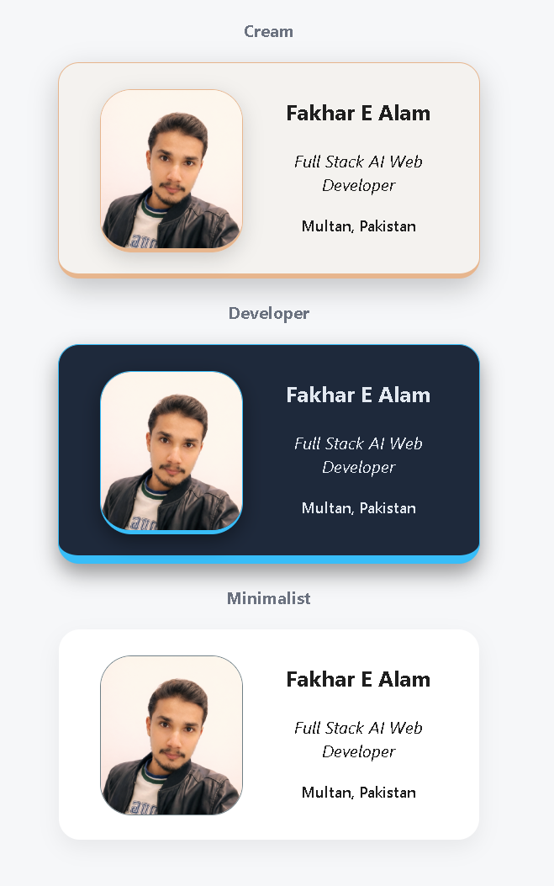

# 🎨 Animated Business Card – Three Themes

A stylish HTML & CSS animated business card project featuring three visual themes:
- Cream
- Developer
- Minimalist
Each card presents the same personal information while demonstrating different visual styles using CSS themes, hover effects, and animations.
This project focuses on clean UI design, reusable CSS architecture, and micro-interactions.

# 🚀 Preview

The page displays three versions of the same business card:
 1- Cream Theme – Warm and elegant tones
 2- Developer Theme – Dark developer-inspired interface 
 3- Minimalist Theme – Clean and simple layout
Each card includes:
 - Profile image
 - Name
 - Title
 - Location
Cards smoothly appear with a fade-in animation when the page loads.

# ✨ Features

## 🎨 Three Visual Themes

Three CSS classes control the themes:
 - .card1 → Cream Theme
 - .card2 → Developer Theme
 - .card3 → Minimalist Theme
Each theme adjusts:
- Background color
- Borders
- Shadow intensity
- Hover highlight colors
The HTML structure stays the same while CSS controls the visual differences. 

## 🖱 Interactive Hover Effects

Several micro-interactions are included:
- Profile image scales slightly on hover
- Soft glow shadows appear
- Text color changes
- Animated underline appears
- Elements scale subtly
These interactions add a modern UI feel while keeping the design lightweight.

## 🎬 CSS Animations

Cards animate into view using a fade-in animation:
 - animation: fadeIn 1.2s ease forwards;
This improves the visual presentation when the page loads.

# 🧠 CSS Architecture (DRY Code)

The CSS in this project follows the DRY principle — “Don’t Repeat Yourself.”
Instead of rewriting the same styling multiple times, shared base classes are used.
Example structure:
 - .card1, .card2, .card3
Common layout properties such as:
 - width
 - height
 - border radius
 - flex alignment
 - animation
are defined once, and each theme only overrides the properties that need to change (colors, borders, shadows).
This approach keeps the CSS:
 - cleaner
 - easier to maintain
 - easier to expand with new themes

## CSS Inheritance / Shared Styling

Reusable classes like:
 - .image
 - .info
define base styles that all cards inherit.
Then theme-specific styles override only what changes, for example:
 - .card1 .image
 - .card2 .image
 - .card3 .image
This avoids redefining the entire class and keeps the stylesheet organized and scalable.4

# 📁 Project Structure
business-card-project
 - index.html
 - style.css
 - profile.png
 - README.md

index.html:
 - Contains the layout and card structure.
style.css:
 - Controls themes, animations, hover effects, and shared styling.
profile.png:
 - Profile image displayed inside the cards.

# 🧪 Technologies Used

 - HTML5
 - CSS3
 - Flexbox
 - CSS Animations
 - Hover Effects

# 🎯 Purpose of the Project

This project was created to practice:
 - UI design using pure CSS
 - Reusable CSS architecture
 - Theme-based styling
 - Interactive hover effects
 - Clean and organized code structure

# 👨‍💻 Author

Fakhar E Alam
Full Stack AI Web Developer
Multan, Pakistan

# 📜 License

Open source and free to use for learning and personal projects.

# 📷 Screenshot

Below is a preview of the three themed business cards:
 - Cream Theme
 - Developer Theme
 - Minimalist Theme

